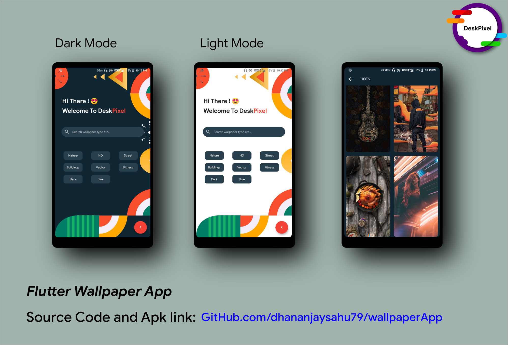

# deskpixel

A new Flutter project. ie Flutter Wallpaper Application.
playstore link https://play.google.com/store/apps/details?id=com.sahu.deskpixel

Used Pexels Api for fetching some trending photos.

Used cloud firestore and Google Drive for storing hots wallpapers.

Used java code for setting up Wallpaper in HomeScreen and LockScreen. So, Do checkout the MainActivity.java File.

If you like it, drop a Star 😍

